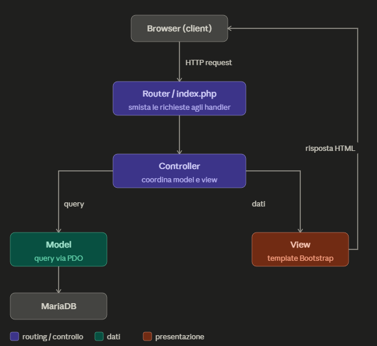

# Architettura del Sistema

Il progetto adotta il pattern architetturale **Model-View-Controller (MVC)** per garantire una netta separazione tra la logica di business, i dati e l'interfaccia utente.

## 🔄 Flusso di una Richiesta

1.  **Entry Point**: Ogni richiesta viene canalizzata verso `index.php`.
2.  **Routing**: Il sistema analizza l'URL per identificare il **Controller** e l'**Azione** (metodo) da eseguire.
3.  **Controller**: Riceve l'input, valida la richiesta e interagisce con il **Model** appropriato.
4.  **Model**: Dialoga con il database, esegue la logica sui dati e restituisce i risultati al Controller.
5.  **View**: Il Controller riceve i dati dal Model, seleziona la **View** corretta e renderizza la risposta finale per l'utente.

## 🛠️ Componenti Principali

### Controller
I Controller fungono da intermediari e coordinano il comportamento dell'applicazione.

* **ErrorController**: Gestisce esclusivamente la visualizzazione degli errori, come la pagina 404 (Not Found).
* **ListingsController**: Coordina la logica della bacheca generale e l'applicazione dei filtri di ricerca.
* **LoginController**: Gestisce i processi di autenticazione e la registrazione dei nuovi utenti.
* **MainController**: Gestisce la visualizzazione dei contenuti dinamici e delle inserzioni in evidenza nella Homepage.
* **PersonalAreaController**: Supervisiona la gestione del profilo utente e delle proprie inserzioni.
* **ViewListingController**: Gestisce la visualizzazione dettagliata del singolo annuncio e la logica di prenotazione degli appuntamenti.

### Model
I Model rappresentano lo strato di accesso ai dati. Tutti i modelli estendono una classe base che gestisce la connessione al DB.

* **ListingsModel**: Implementa le operazioni CRUD (Create, Read, Update, Delete) sulla tabella degli annunci e la logica di filtraggio avanzato.
* **LoginModel**: Gestisce l'interazione con la tabella utenti per la verifica delle credenziali, la gestione della sicurezza (hashing password) e l'inserimento di nuovi profili.
* **MainModel**: Estrae e organizza i dati specifici necessari per il layout della pagina principale.
* **PersonalAreaModel**: Fornisce i metodi per manipolare i dati dell'utente autenticato e gestire lo stato degli annunci personali.
* **ViewListingsModel**: Gestisce il recupero dei dati del singolo annuncio, la logica di prenotazione appuntamenti, la gestione del carrello e il completamento della vendita dei libri.

### View
Lo strato di presentazione è progettato per essere modulare.

* **Struttura**: I file sono organizzati in `templates` (che definiscono la struttura HTML fissa come header e footer) e `views` (che contengono il contenuto specifico della pagina).
* **Dinamicità**: Il controller utilizza la variabile `$view` per includere dinamicamente il file di vista corretto all'interno del template principale.
* **Form**: Le viste ospitano i form per l'interazione dell'utente, i cui dati vengono inviati ai rispettivi controller.

## 🔐 Sicurezza e Sessioni

* **Autenticazione**: Lo stato dell'utente è persistito tramite l'array globale `$_SESSION`.
* **Protezione delle Rotte**: L'accesso alle aree riservate è protetto tramite il metodo `isLogged()`, richiamato all'inizio delle azioni sensibili.
* **Validazione Dati**: Tutti gli input provenienti dall'utente (POST/GET) sono sottoposti a processi di sanitizzazione e validazione prima di essere utilizzati nelle query SQL per prevenire attacchi di tipo SQL Injection e XSS. I dati in output nelle view sono codificati con `htmlspecialchars()` per prevenire attacchi XSS.