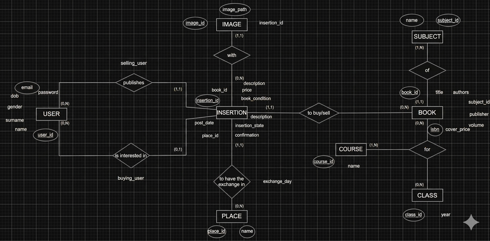

#  Documentazione Database

In questa sezione viene analizzata la struttura dati del progetto Bookly, partendo dalla progettazione concettuale fino all'implementazione fisica.

---

## 1. Schema ER (Entità-Relazione)
Lo schema ER rappresenta le entità principali del sistema e le relazioni che intercorrono tra esse.



### Descrizione delle Relazioni
* **Utente - Inserzione (1:N)**: Un utente può pubblicare più inserzioni, ma ogni inserzione appartiene a un solo venditore (`selling_user`).
* **Libro - Inserzione (1:N)**: Un libro (identificato univocamente dall'ISBN) può essere presente in più inserzioni (es. diversi utenti vendono lo stesso titolo).
* **Transazione (1:1)**: Un'inserzione può essere riservata da un solo acquirente (`buying_user`).

---

## 2. Schema SQL (DDL)
Di seguito è riportato lo script SQL per la creazione delle tabelle.

```sql
-- Script di creazione database
